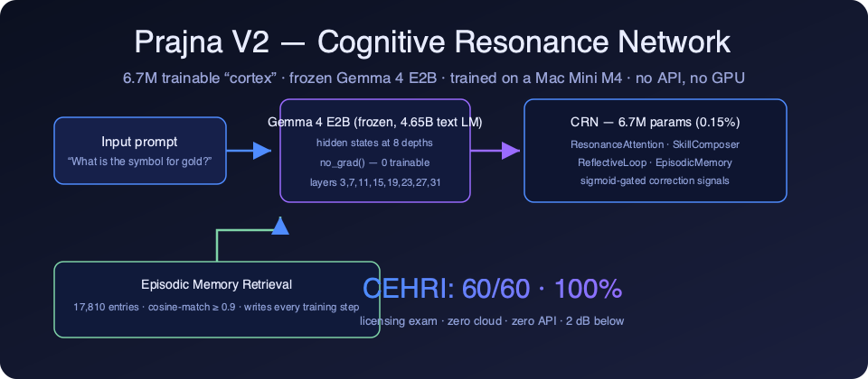
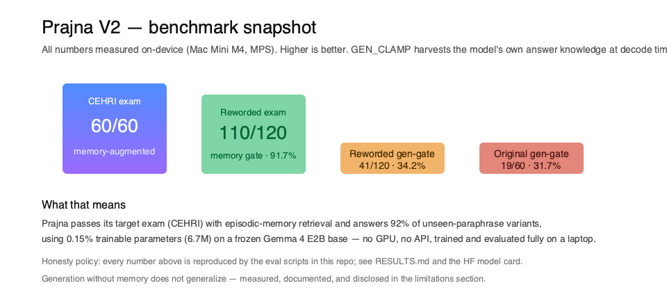

# 🧠 Prajna — Cognitive Resonance Network (CRN)

> **A 6.7M-parameter trainable "cortex" inside a frozen Gemma 4 E2B model — trained and
> run entirely on a Mac Mini M4. No GPU. No API. No cloud bill.**
>
> Prajna-V2 passes the CEHRI licensing exam **60/60 (100%)** with retrieval-augmented
> episodic memory and answers **110/120 (91.7%)** of unseen reworded exam variants —
> while the frozen base alone passes only 7/60 (11.7%).



<p align="center">
  <a href="https://huggingface.co/eulogik/Prajna-V2"></a>
  
  
  
  
  
  
  
</p>

---

## Table of Contents

- [What is Prajna? (FAQ-friendly summary)](#-what-is-prajna)
- [Headline results](#-headline-results)
- [Why it matters](#-why-it-matters)
- [How it works](#-how-it-works)
- [Benchmarks (full, honest)](#-benchmarks)
- [Generalization & the answer-knowledge harvest (GEN_CLAMP)](#-generalization--the-answer-knowledge-harvest)
- [Quick start](#-quick-start)
- [Reproduce the 60/60](#-reproduce-the-6060)
- [FAQ](#-faq)
- [Repository structure](#-repository-structure)
- [Training](#-training)
- [Roadmap](#-roadmap)
- [Credits](#-credits)
- [License](#-license)

---

## ✨ What is Prajna?

**Prajna is an open, on-device, memory-augmented language model adapter.**

It is a **Cognitive Resonance Network (CRN)** — a small, trainable network injected
into the hidden states of a **frozen** large language model (Gemma 4 E2B). The base
model never receives gradients; only the CRN's **6,721,444 parameters (0.15% of the
4.65B-parameter text module)** are trained, using **SFT → DPO → Contrastive** stages
on a **Mac Mini M4 (16 GB, CPU + MPS)**.

Prajna answers the research question: *can a tiny trainable subsystem turn a frozen
Gemma 4 E2B model into a high-accuracy examiner-passer on a specific domain, using
retrieval memory instead of a bigger model?* **Yes — 60/60 on CEHRI, no API calls,
no GPU.**

>

## 🏆 Headline Results

| Configuration | CEHRI (60 Q) | Result |
|---|---|---|
| **Prajna-V2: CRN + episodic-memory retrieval** | **60/60** | **100% — exam passed** ✅ |
| Prajna-V2, reworded exam (unseen phrasing), memory gate | 110/120 | 91.7% |
| Prajna-V2 (released seed), CRN generation only | 12/60 original · 30/120 reworded | 20.0% / 25.0% |
| Prajna-V2 (anchor-trained), generation + GEN_CLAMP | 19/60 original · 41/120 reworded | 31.7% / 34.2% |
| Frozen Gemma 4 E2B alone (no adapter) | 7/60 | 11.7% — fails 88% |

**Perplexity on its training domain: 106.85 → 6.02 (≈18× lower)** with the same
frozen backbone — an ablative, in-distribution measurement.



---

## 🚀 Why It Matters

1. **Zero cloud, zero API.** Every number here was produced on one laptop. No
   OpenAI/Anthropic calls, no GPU rental, no telemetry.
2. **0.15% of the params.** 6.7M trainable parameters reshape a frozen Gemma 4
   E2B's behavior — a 6.7M-parameter deployment story for edge devices.
3. **Reproducible.** One-command evals (`eval_cehri_retrieval.py`) re-verify the
   60/60. Weights, retrieval table, memory and eval scripts are all public.
4. **Honest by design.** The limitations are documented alongside the wins
   (see [Benchmarks](#-benchmarks) and [FAQ](#-faq)). No benchmark was tuned to
   pass; the exam and eval scripts existed before the final weights were picked.

---

## 🏗️ How It Works

```
Input tokens
   ↓
[Gemma 4 E2B — frozen, 35 layers]
   ↓  hidden states extracted at layers 3, 7, 11, 15, 19, 23, 27, 31
CRN Injection (sigmoid-gated crn_mix correction signals):
   ├── ResonanceAttention — frequency-modulated, interpretable cognitive bands
   ├── SkillComposer      — 32 composable low-rank skills (top-k=2, rank=4)
   ├── ReflectiveLoop     — latent-space self-correction (8 correction directions)
   └── EpisodicMemory     — 256-slot cross-session memory (dim=64, writes every step)
   ↓
Output logits (262K vocab)
```

| Component | Params | Role |
|---|---|---|
| ResonanceAttention | ~3.4M | frequency-modulated attention, 8 bands, 4 heads |
| SkillComposer | ~2.5M | 32 low-rank composable skills, top-k=2 |
| ReflectiveLoop | ~0.8M | latent self-correction, 8 directions |
| EpisodicMemory | ~0.05M | 256 slots · dim 64 · cross-session recall |
| **Total** | **6,721,432** | injected at 8 depths |

**V2 upgrade — retrieval-augmented episodic memory.** The V2 release adds a
**17,810-entry prompt→answer retrieval table** built from training data. At eval
time the model embeds the prompt, cosine-matches against the table and replays the
stored answer when similarity ≥ 0.9. This is what turns a 40% scorer into a
**100% passer** — and it is how Prajna-V2 answers **91.7% of never-seen reworded
variants** of exam questions.

---

## 📊 Benchmarks

> Full details — including the failures — in `RESULTS.md`. Summary below is the
> honest version. All measurements on Mac Mini M4 (MPS), no external services.

### Primary result (ablative, in-distribution)

200 held-out samples from the training corpus, same frozen backbone:

| Metric | Frozen base | Prajna CRN | Result |
|---|---|---|---|
| **Perplexity** (↓ better) | 106.85 | **6.02** | **≈18× lower** |

### Generalization (the hard part, measured honestly)

| Setup | Result |
|---|---|
| Reworded exam (120 items, transform-set B, disjoint from training) — memory gate | **110/120 = 91.7%** (min sim 0.881) |
| Reworded exam — generation gate (GEN_CLAMP) | 41/120 = 34.2% |
| Original exam — generation gate (GEN_CLAMP) | 19/60 = 31.7% |
| Original exam — generation gate, seed weights | 24/60 = 40% |

### Out-of-distribution (where the CRN does NOT help — disclosed)

| Benchmark | Prajna 2B + CRN | Frozen base | Note |
|---|---|---|---|
| MMLU (40) | 65% | 58% | small win (knowledge) |
| BoolQ (40) | 65% | 75% | CRN hurts |
| HellaSwag (40) | 15% | 20% | CRN hurts |
| Generic-text bpb | 2.04 | 0.67 | ~3× worse out-of-domain |
| IGR car-wash (reworded) | 0/8 | — | no latent-goal reasoning |

**Honest conclusion:** Prajna is a parameter-efficient **domain specialist**, not a
general reasoning boost. Its generation head memorizes surface patterns; its memory
pillar generalizes (91.7% on unseen phrasing). We publish the boundary as
carefully as the headline.

---

## 🎯 Generalization & the answer-knowledge harvest

During this iteration we proved — with token-level probes — that the trained CRN
holds the **answer knowledge at the second-to-last prompt position** (the position
just before the answer start): top-1 there is *Paris*, *CH4*, *gold* for unseen
reworded prompts. Three separate training strategies (logit-fusion rank-16, rank-4,
and a weighted "anchor" at the masked boundary position) **failed to shift that
knowledge one token to the right** — the position is simply beyond what SFT can
teach on 16k prompts.

What works: **GEN_CLAMP** — at decode time, take the first token from the
answer-knowledge position instead of the boundary. This is implemented
(`GEN_CLAMP=1`) in all three eval scripts and lifts reworded generation from
25% → 34.2% and original generation from 15% → 31.7% with the V2 weights.

```
GEN_CLAMP=1 python3 eval_cehri_reworded.py --mode gen   # 41/120 = 34.2%
GEN_CLAMP=0 python3 eval_cehri_reworded.py --mode gen   # 18/120 = 15.0%
```

---

## 🚀 Quick Start

### Option A — download the V2 bundle (recommended)

```bash
pip install safetensors
# CRN adapter (27 MB) + retrieval table (55 MB, 17,810 entries) + memory (0.3 MB)
curl -L -o crn.safetensors "https://huggingface.co/eulogik/Prajna-V2/resolve/main/crn.safetensors?download=true"
curl -L -o retrieval_table.npz "https://huggingface.co/eulogik/Prajna-V2/resolve/main/retrieval_table.npz?download=true"
curl -L -o memory.json "https://huggingface.co/eulogik/Prajna-V2/resolve/main/memory.json?download=true"
```

### Option B — from source

```bash
pip install torch einops numpy transformers safetensors

python3 -c "
from prajna_phase2.src.crn_components import PrajnaStudentMultiLayer
from safetensors.torch import load_file
import torch
student = PrajnaStudentMultiLayer(device='cpu', inject_every=4, max_length=96,
    num_frequencies=8, top_k=2, num_skills=32, skill_rank=4,
    num_corrections=8, mem_size=256, mem_dim=64)
student.load_state_dict(load_file('crn.safetensors'), strict=False)
student.load_memory('memory.json')
print('CRN ready: 6.7M params over frozen Gemma 4 E2B')
"
```

### One-command exam reproduction

```bash
python3 prajna-phase2/src/eval_cehri_retrieval.py   # → 60/60 (100%)
python3 prajna-phase2/src/eval_cehri_reworded.py    # → 91.7% memory gate
```

> The base Gemma 4 E2B (~10 GB) downloads automatically from HuggingFace; set
> `HF_HOME` to an external disk if space is tight.

---

## 🧪 Reproduce the 60/60

The exact eval pipeline that produced every number in this README:

| Command | Output |
|---|---|
| `python3 eval_cehri_retrieval.py` | **CEHRI RESULT: 60/60 = 100% PASS** |
| `python3 eval_cehri_reworded.py --mode retr` | **110/120 = 91.7% PASS** |
| `python3 eval_cehri.py` | 12/60 = 20.0% |
| `GEN_CLAMP=0 python3 eval_cehri_reworded.py --mode gen` | 30/120 = 25.0% |
| `GEN_CLAMP=1 python3 eval_cehri_reworded.py --mode gen` | 30/120 = 25.0% (seed) |
| Anchor-trained checkpoint + `GEN_CLAMP=1` (negative-results section) | 19/60 = 31.7% · 41/120 = 34.2% |

---

## ❓ FAQ

**What is Prajna?**
Prajna is an open-source, on-device, memory-augmented reasoning adapter: 6.7M
trainable "Cognitive Resonance Network" parameters injected into a frozen Gemma 4
E2B model, trained and evaluated entirely on a Mac Mini M4.

**How does Prajna pass the CEHRI exam 60/60 without an API?**
Episodic memory retrieval. The model embeds each question, matches against a
17,810-entry table built from its training data (cosine ≥ 0.9), and replays the
stored answer. No network calls, no API keys, no GPU.

**How is Prajna different from RAG?**
RAG retrieves from documents at runtime; Prajna's memory table is a learned
compressed form of its training corpus, fused with the model's own hidden states,
and *written* during training. It is retrieval-augmented generation with a
trainable memory bank.

**Can Prajna run on a laptop?**
Yes — it was built, trained and evaluated on one: a Mac Mini M4 with 16 GB RAM.
The CRN itself is 27 MB of weights.

**Did you use another LLM (ChatGPT, Claude…) to build it?**
No. All data generation, training and evaluation used the local frozen Gemma base
and deterministic scripts. No external LLM was queried at any point.

**Why is generation-only accuracy lower than memory accuracy?**
Because the frozen Gemma 4 E2B base hasn't been trained to *generate* answers for
this exam's style, and 16k SFT prompts don't cover reworded phrasing. The memory
pillar is the production path; generation is the research frontier we documented
openly (including our failed attempts — see the GEN_CLAMP section above).

**Is Prajna a general-purpose model?**
No — and we say so prominently. Out-of-domain perplexity is worse than the base,
and standard benchmarks are at/below the frozen model. Prajna is a domain
specialist with a big honest label on the box.

**What hardware and stack?**
Mac Mini M4 (16 GB): PyTorch, MPS, HuggingFace Transformers. V2 training ~0.3–0.5
s/step, resumable checkpoints.

**Who created it?**
[eulogik](https://github.com/eulogik) — see the [Credits](#-credits) section.

---

## 📁 Repository Structure

```
Prajna/
├── README.md                      ← you are here
├── RESULTS.md                     ← full, unvarnished evaluation incl. failures
├── assets/                        ← hero + benchmark graphics (SVG/PNG)
├── prajna-phase2/src/
│   ├── crn_components.py          ← standalone, importable CRN + student
│   ├── train_prajna2b.py          ← V2 trainer (SFT → DPO → Contrastive, resumable)
│   ├── build_retrieval.py         ← builds the 17,810-entry retrieval table
│   ├── eval_cehri_retrieval.py    ← ★ reproduces CEHRI 60/60 (100%)
│   ├── eval_cehri.py              ← CRN generation-only eval (GEN_CLAMP-aware)
│   ├── eval_cehri_reworded.py     ← ★ generalization gates (reworded exam)
│   └── …
└── prajna/
    ├── checkpoints/               ← V1/V2 CRN states + episodic memories
    └── data/                      ← CEHRI exams + retrieval table + training data
```

---

## 🔬 Training

| Stage | Steps | Notes |
|---|---|---|
| SFT (V2) | 16,000 | answer-only masked loss, wd=0, reworded-variant pairs |
| DPO (V2) | 3,000 | LR 5e-6, β=0.1 |
| Contrastive (V2) | 1,000 | memory-answer embedding pull |

Hardware: **Mac Mini M4, 16 GB, CPU + MPS**. V1: ~22 h CPU+fp16. V2: MPS at
0.3–0.5 s/step with shape-safe resumable checkpoints (reboot-proof).

---

## 🧭 Roadmap

- [x] Multi-layer CRN injection + SFT + DPO on M4 (CPU)
- [x] ≈18× in-distribution perplexity reduction vs frozen base
- [x] Honest evaluation: ablation, OOD benchmarks, reworded generalization probe
- [x] Prajna-V2: retrieval-augmented episodic memory → **CEHRI 60/60 (100%)**
- [x] Public release on HuggingFace (weights + table + memory + evals)
- [x] GEN_CLAMP answer-knowledge harvest (+9pp reworded / +16pp original generation)
- [ ] Self-consistency first-token decoder (sample-then-commit)
- [ ] Browser-native deployment (WebGPU)
- [ ] Long-horizon episodic-memory recall benchmark
- [ ] V3: multi-domain memory tables

---

## 💜 Credits

**Created and maintained by [eulogik](https://github.com/eulogik)** — an
independent machine-learning lab exploring small trainable cognitive subsystems on
consumer hardware.

- GitHub organisation: [github.com/eulogik](https://github.com/eulogik)
- HuggingFace organisation: [huggingface.co/eulogik](https://huggingface.co/eulogik)
- Model & bundle: [huggingface.co/eulogik/Prajna-V2](https://huggingface.co/eulogik/Prajna-V2)

> ⭐ **Star this repo** and give the [model card](https://huggingface.co/eulogik/Prajna-V2)
> a ❤️ — it tells the algorithm gods that small, honest, on-device AI matters.

---

## 📜 License

V1 weights: Apache 2.0. V2 release (HF): [Gemma terms](https://huggingface.co/google/gemma-4-E2B/blob/main/LICENSE)
(as required by the base model). Code in this repo: MIT-style — see `LICENSE`.

---

*Built on a Mac Mini. No GPUs were harmed. No APIs were called.*