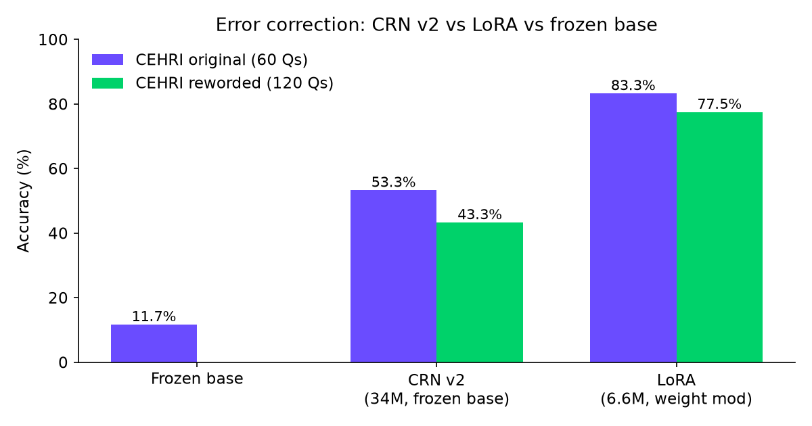
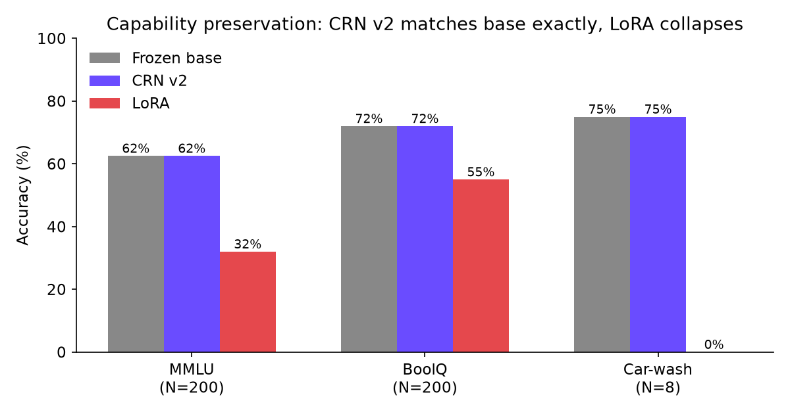
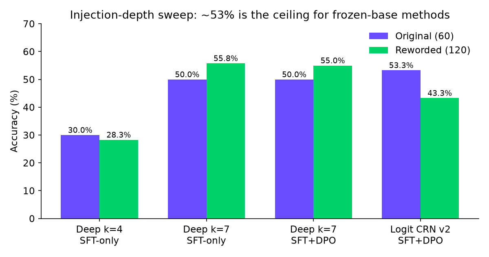

# CRN v2: Safe Error Correction for Language Models

<p>
  <a href="https://huggingface.co/eulogik/Prajna-CRNv2"></a>
  
  <a href="https://github.com/eulogik/prajna"></a>
  
  
  
</p>

A lightweight correction module that fixes errors in language model outputs without degrading base capabilities.

## What it does

CRN v2 sits on top of a frozen base model and learns to adjust its logits when it detects errors. The base model **never changes** — only a small correction module is trained.

```
corrected_logits = base_logits + gate * up(gelu(down(hidden)))
```

## Results

| | CEHRI Original | CEHRI Reworded | MMLU | BoolQ | Car-wash |
|---|---|---|---|---|---|
| **Base (Gemma-4-E2B)** | — | — | 62.5% | 72% | 75% |
| **CRN v2** | **53.3%** | **43.3%** | 62.5% | 72% | 75% |
| LoRA baseline | 83.3% | 77.5% | 32% | 55% | 0% |

CRN v2 corrects 53% of errors with **zero capability loss**. LoRA corrects 83% but destroys 30-75% of base capabilities.




## Injection-depth sweep (experimental)

A hidden-state injection variant (`crn_deep.py`, 1.6M params, rank=512) confirms ~53% as the ceiling for frozen-base methods:

| Variant | Training | CEHRI Original | CEHRI Reworded | Capability |
|---|---|---|---|---|
| Deep layer 4 | SFT-only | 30.0% | 28.3% | not probed |
| Deep layer 7 | SFT-only | 50.0% | 55.8% | intact (small probe) |
| Deep layer 7 | SFT + DPO | 50.0% | 55.0% | **destroyed** (MMLU 13%) |
| **Logit CRN v2** | SFT + DPO | **53.3%** | 43.3% | intact |

Deeper injection helps but never beats logit correction. DPO at depth destroys capabilities. Deep variant is released as **code only** (no trained checkpoints).



## Quick start

```bash
pip install torch transformers
python inference.py
```

Interactive mode:
```
Prompt: What is the capital of France?
Draft:  London
CRN v2 corrected: Paris
```

Single-shot:
```bash
python inference.py --prompt "What is 2+2?" --draft "5"
```

## Files

```
release/
├── crn_v2.py              # Model architecture (LogitCorrection + CRNv2)
├── crn_deep.py            # Experimental hidden-state injection variant (code only, no weights)
├── inference.py            # Demo / interactive inference
├── checkpoints/
│   └── crn_v2_dpo.pt      # Trained correction weights (136MB)
└── README.md
```

## Requirements

- Python 3.10+
- PyTorch 2.0+
- transformers
- ~10GB RAM (loads Gemma-4-E2B in float16)

## Architecture

- **Base model**: google/gemma-4-E2B (4.6B params, frozen)
- **Correction module**: Low-rank bottleneck (rank=128), ~34M params
- **Deep variant**: Hidden-state injection at layers 4/7 (rank=512), ~1.6M params, experimental
- **Training**: Supervised fine-tuning + DPO (reference-free) with KL preservation
- **KL preservation**: Penalizes deviation from base logits, ensuring corrections only happen where needed

## License

Research use only. Base model subject to Gemma license.
